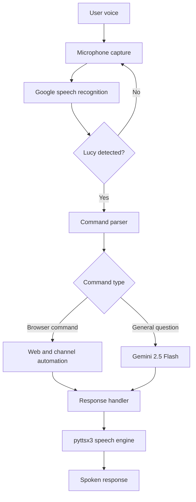

<div align="center">

# 🎙️ Lucy - AI Voice Assistant

A lightweight Python voice assistant powered by **Google Gemini 2.5 Flash**, voice recognition, browser automation, and text-to-speech.


</div>

---

## Overview

Lucy listens for the **“Lucy”** wake word, converts speech into text, and routes the command to either a browser automation or Gemini. The result is delivered as a spoken response using `pyttsx3`.

---

## Features

* Wake-word activation using **“Lucy”**
* Google speech recognition
* Gemini 2.5 Flash integration
* Browser and channel automation
* Text-to-speech responses
* Environment-based API-key protection

---

## System Architecture



---

## Technology Stack

| Technology                | Purpose                            |
| ------------------------- | ---------------------------------- |
| Python                    | Core application                   |
| SpeechRecognition         | Converts voice input into text     |
| Google Speech Recognition | Processes microphone audio         |
| Gemini 2.5 Flash          | Generates AI responses             |
| google-genai              | Connects the application to Gemini |
| pyttsx3                   | Converts responses into speech     |
| python-dotenv             | Loads environment variables        |
| webbrowser                | Opens websites and media links     |

---

## Project Structure

```text
Lucy---AI-Voice-Assistant/
├── main.py              # Voice recognition and command processing
├── mychannels.py        # Website and media channel mappings
├── requirements.txt     # Python dependencies
├── .env                 # Gemini API key — not committed
├── .gitignore           # Git exclusion rules
├── LICENSE              # MIT License
└── README.md            # Project documentation
```

---

## Installation

### 1. Clone the Repository

```bash
git clone https://github.com/bipulkumar62/Lucy---AI-Voice-Assistant.git
cd Lucy---AI-Voice-Assistant
```

### 2. Create a Virtual Environment

#### Windows PowerShell

```powershell
python -m venv .venv
.\.venv\Scripts\Activate.ps1
```

#### macOS or Linux

```bash
python3 -m venv .venv
source .venv/bin/activate
```

### 3. Install Dependencies

```bash
python -m pip install -r requirements.txt
```

### 4. Configure Gemini

Create a `.env` file in the project directory:

```dotenv
GEMINI_API_KEY=your_gemini_api_key
```

Create a Gemini API key from [Google AI Studio](https://aistudio.google.com/app/apikey).

---

## Usage

Start Lucy:

```bash
python main.py
```

Say **“Lucy”** followed by a command.

| Voice command                      | Action                                  |
| ---------------------------------- | --------------------------------------- |
| `Lucy, open Google`                | Opens Google                            |
| `Lucy, open GitHub`                | Opens the configured GitHub profile     |
| `Lucy, open YouTube`               | Opens the configured YouTube channel    |
| `Lucy, open Bugatti`               | Opens the configured Bugatti media link |
| `Lucy, what is quantum computing?` | Generates and speaks a Gemini response  |

---

## Security

Keep credentials outside the source code. Add the following entries to `.gitignore`:

```gitignore
.env
.venv/
__pycache__/
*.py[cod]
```

Access the Gemini key through the environment:

```python
import os

gemini_api_key = os.getenv("GEMINI_API_KEY")
```

Never commit API keys, passwords, or access tokens.

---

## License

This project is licensed under the [MIT License](LICENSE).

